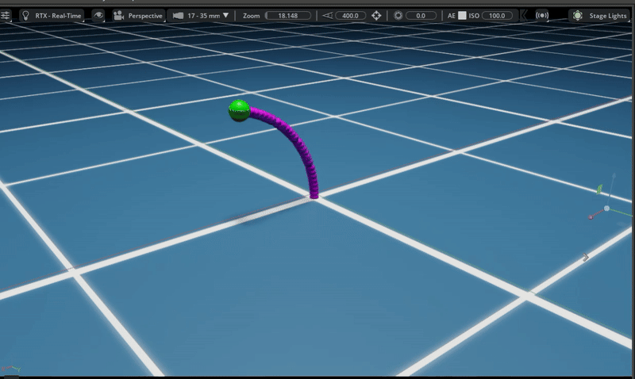

# SoftRobot_IsaacSim
This script simulates the dynamics of a soft robotic system using a combination of PyTorch, numerical integration (via torchdiffeq), and visualization through NVIDIA's Isaac Sim. The robot's behavior is modeled through ordinary differential equations (ODEs), enabling simulation of deformation and movement based on control inputs.

# Key Components:

- PyTorch: For numerical computations and ODE solving.
- torchdiffeq: For solving ODEs using numerical integration.
- Isaac Sim: For visualizing the robot in a simulated 3D environment.

# Dependencies:

Ensure the following libraries are installed:

- torch
- torchdiffeq
- numpy
- matplotlib
- isaacsim (NVIDIA Isaac Sim)

# Installation:

To install the necessary Python libraries, run:

Make sure NVIDIA Isaac Sim is properly installed and configured. For Isaac Sim installation instructions, refer to the official NVIDIA Isaac Sim documentation.

# How to Run:

Navigate to your Isaac Sim installation directory in the terminal and execute:

Replace <PATH_TO_SCRIPT> with the actual path to your softRobot.py file.

# Running the Simulation:

The simulation visualizes a soft robotic structure dynamically responding to sinusoidal input signals.

You can observe how the soft robot's segments deform over time in response to these inputs.

# Modifying the Script:

Adjust the actions tensor to customize robot control signals and behaviors.

Modify the parameters like segment length (l0), cable offset (d), and ODE time steps (ds) in the sfr class to suit your application.

Enjoy experimenting with soft robot dynamics!

